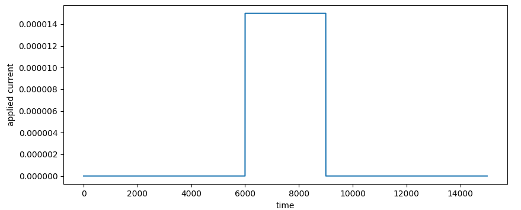
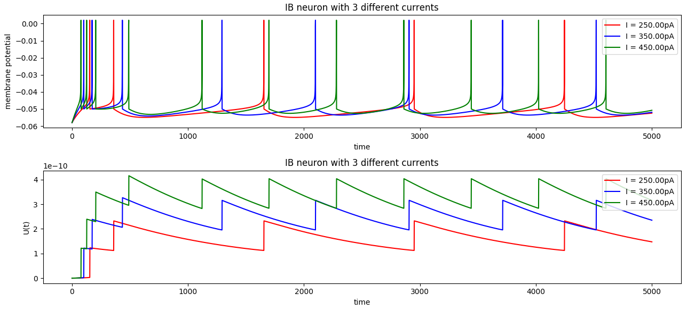
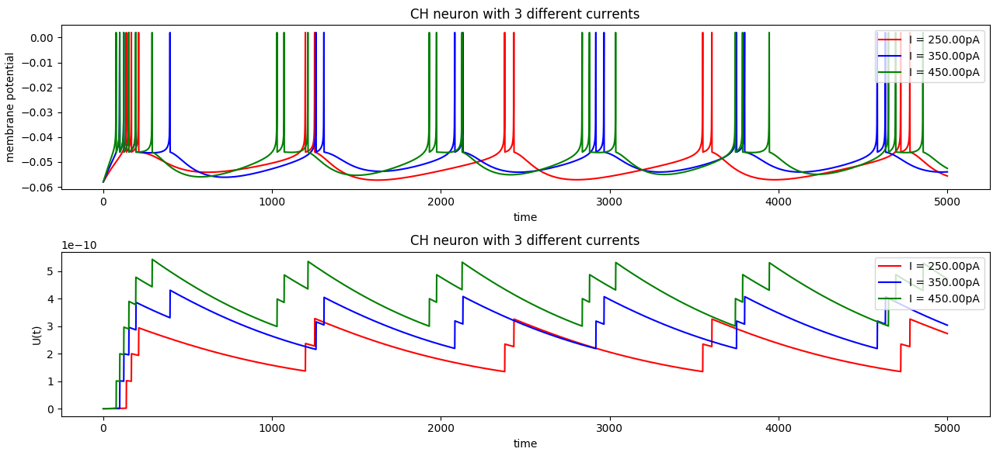
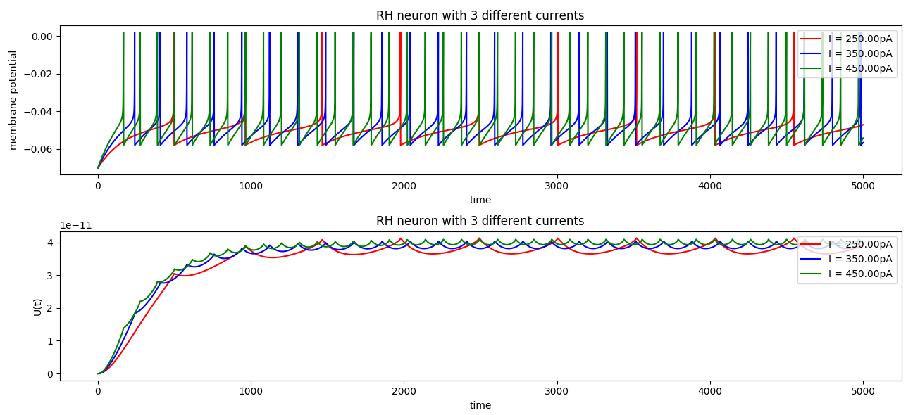
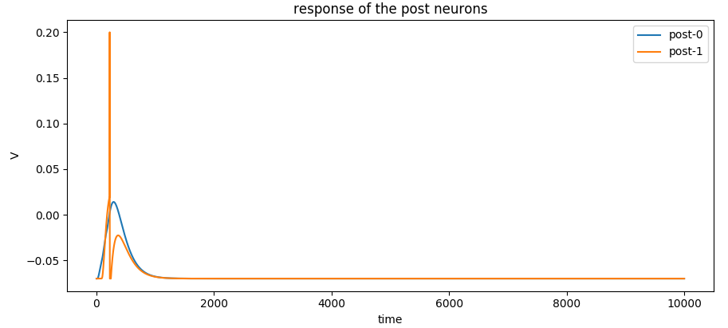

<p align="center"></p>

## 3rd Gen Neural Networks
Current Deep Learning methods (2nd Gen) set very impressive state of the art results, although the building blocks such as *convolutions etc* are biologically inspired ***they still are not as efficient as computations happening at many biological neural networks***

Spiking Neural Networks (SNNs) is an attempt to simulate biological networks closely. Broadly the framework consists of **Spikes**, **Neurons**, **Synapses**, **Networks**.
**Neurapse** is a package in python which implements some of the fundamental blocks of SNN and is written in a manner so that it can easily be extended and customized.

This project is motivated from the work of Intel and IBM in the domain of Spiking Neural Networks. Intel's recently launched ***Loihi*** chip uses asynchronous SNNs to implement adaptive self-modifying event-driven fine-grained parallel computations used to implement learning with high efficiency. 

Biological neural networks have been studied vastly since the early 19th century. Several neuronal models have been proposed and used in simulations, showing close resemblance of biological neural networks. To study more about Biological neural networks, visit [Prof. Gerstner's course on Neuronal Dynamics](https://lcn.epfl.ch/~gerstner/NeuronalDynamics-MOOC1.html). This package is an introductory framework for getting started with computational neuroscience.

***
*(This project was started as a part of assignments in the course EE 746: Neuromorphic Engineering (Instructor: [Prof. Udayan Ganguly](https://www.ee.iitb.ac.in/wiki/faculty/udayan)) at **the Indian Institute of Technology, Bombay**)*

## Supports
- `Neurons` : Hodgkin Huxley (HH), Adaptive Exponential Integrate and Fire (AEF) , Leaky integrate and Fire (LIF), IZHIKEVICH
- `Synapses`: Constant Synapse (No STDP), Plastic Synapses (2 kinds of STDP)
- `Networks`: Feed Forward using LIF, Dynamic Random Networks

## Requirements
- Python 3.6+
- `numpy`
- `matplotlib`

## How to use?
clone or fork this repository by `git clone https://github.com/udion/Neurapse`. Make sure you have the dependencies given in the `requirements.txt` (*So far it only requires numpy, matplotlib*)

Some examples are given with the comments in `examples*.py`. 

## Importing a neuron ([or jump to Network example](#importing-a-network))
```python
import numpy as np
import matplotlib.pyplot as plt

import Neurapse.Neurons as Neu #importing Hodgkin-Huxley neuron
import Neurapse.utils.CURRENTS as Cur #to generate currents (Square pulse in this example)
```

Neurons in SNN frameworks are described using certain parameters such as *Capacitance, Resting potentials, Time constants **etc***

Hodgkin-Huxley neuron in particular has the following parameters :
```python
C = 1e-6
E_Na = 50e-3
E_k = -77e-3
E_l = -55e-3
g_Na = 120e-3
g_k = 36e-3
g_l = 0.3e-3
I0 = 15e-6

Neuron = Neu.HH(C, E_Na, E_k, E_l, g_Na, g_k, g_l)

T = 30e-3 # Time in seconds
delta_t = 1e-5 # quanta in which time updates in seconds
n_t = int(5*T//delta_t)+1 # Total time of simulation is 5*T, hence number of time-steps is n_t
```
Let's generate the input current and visualise it
```python
Sq1 = Cur.SQUARE_PULSE(t_start=6000, t_end=9000, T=n_t)
I = Sq1.generate() # normalised current i.e maximum amplitude is 1 unit, of shape [1 X T]
I = I0*I # I is input current to the neuron in micro-Ampere 

plt.plot(I)
plt.xlabel('time')
plt.ylabel('applied current')
plt.show() #graph shown below
```


Let's pass this current to the `Neuron (hodgkin-huxley defined above)`. *Neurons have a `.compute()` function which will give the response of the neuron, given intial condition and input current*

```python
# initial conditions of neurons will be of shape [num_neuron X 1], in this case num neurons
# These are the initial conditions of Hodgkin-Huxley, checkout the reading material
# to figure out how to get these, for now enjoy the ride :P
V0 = -0.06515672*np.ones((1,1))
h0 = 0.60159082*np.ones((1,1))
m0 = 0.05196212*np.ones((1,1))
n0 = 0.31527801*np.ones((1,1))

# response of the HH neuron
# V is the membrane potential, m/h/n are the current parameters of HH
V, h, m, n = Neuron.compute(V0, h0, m0, n0, I, delta_t)

# we can get Sodium/Pottasium channel currents using h,m,n
i_Na = g_Na*(m**3)*h*(V-E_Na)
i_k = g_k*(n**4)*(V-E_k)
i_l = g_l*(V-E_l)
```
We can visualise the responses, say `V, i_Na (Sodium channel current), i_k(potassium channel current), leaky current`


We can similarly use other neurons (*HH models the ion channel currents very well, but is expensive in computation due to coupled differential equations of channel currents*). **Adaptive Exponential Integrate and Fire (AEF)** neuron is one such model which is not as complex as **HH** but by tweaking the parameters one can get different behaviour of the neurons. `exampleAEF.py` shows how to use AEF neuron, some responses are

 



## Importing a Network

### Fully connected Network with constant weight Synapse (No STDP)
`NNetwork_Const` class uses `LIF` neurons to build a fully connected SNN as shown in the diagram. To do so one has to specify the fanout, initial weights, synaptic time delay

```python
import numpy as np
import matplotlib.pyplot as plt
import Neurapse.utils.CURRENTS as Cur
from Neurapse.Networks import NNetwork_Const

Fanout = [[0,1],[0,1],[0,1]]
W = [[3000,3000],[3000,3000],[3000,3000]]
Tau = [[1e-3,8e-3],[5e-3,5e-3],[9e-3,1e-3]]  

Net = NNetwork_Const(Fanout, W, Tau, 3, 2) #defines the network
```
Since there are 3 input neurons we will make Input currents of shape `[3 X n_t]` and pass it to the network
```python
I_pre = np.array([
    50e-9*Cur.SQUARE_PULSE(0, 10, 10000).generate(),
    50e-9*Cur.SQUARE_PULSE(40, 50, 10000).generate(),
    50e-9*Cur.SQUARE_PULSE(80, 90, 10000).generate(),
]).reshape(3,-1)

print(I_pre.shape)
V_pre_response, V_post_response, I_sy_list, I_post = Net.compute(I_pre, 1e-4)
```
Now we can see the response of the **2 post synaptic neurons**
```python
 for i in range(2):
    plt.plot(V_post_response[i,:], label='post-{}'.format(i))
plt.legend()
plt.xlabel('time')
plt.ylabel('V')
plt.title('response of the post neurons')
```
This shows that for the given configuration, post-synaptic neuron 1 spikes and other does not spike, hence this configuration is suitable for identifying the given input pattern



